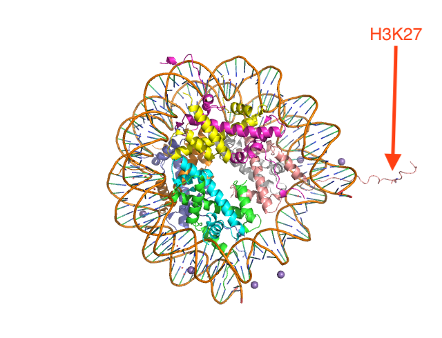

## Epigenetic targets in cancer

[Overview](https://www.nejm.org/doi/full/10.1056/NEJMra1805035#:~:text=Epigenetic%20therapies%20seek%20to%20normalize,or%20maintain%20a%20malignant%20phenotype.) of epiegenetic therapies for cancer.

> Chromatin remains an important therapeutic target. The activity of established and investigational epigenetic therapies in well-defined clinical contexts has provided evidence that this strategy can be effective. Given the sheer number of potential targets, a systematic approach that identifies and validates potential drug targets is needed to focus drug development and achieve the promise of this strategy.

### DNA modifications

Aberrant DNA methylation, for example, has emerged as a recurring oncogenic event.

DNA methyltransferases
[PDB 101](https://pdb101.rcsb.org/motm/139)

[DNA methyl transferase](https://www.rcsb.org/3d-view/1MHT/1) in action

### Histone modifications

Nucleosomes [PDB 101](https://pdb101.rcsb.org/motm/7)

[Crystal structure of nucleosomes](https://www.rcsb.org/structure/1aoi)

1. Histone methyl transferases

2. Histone acetyl tranferases

3. Histone deacetylases

4. Chromatin remodeling

### Therapeutics
1. HDAC inhibitors: vorinostat, romidepsin, belinostat, and panobinostat

2. HMT inhibitors: tazemetostat, Valemetostat, CPI-0209, CPI-1205

3. Lysine demethylase inhibitors: Iadademstat, CC-90011, INCB059872

4. Bromodomain and extraterminal (BET) inhibitors: Molibresib, Birabresib, ZEN003694, PLX51107

5. IDH inhibitors: Ivosidenib, Enasidenib, Vorasidenib, Olutasidenib

### IDH
Isocitrate dehydrogenase is a metabolic enzyme that is mutated in some cancers such that instead of the native reaction (isocitrate to alpha keto glutarate), it catalyzes the further reduction of alpha-keto glutarate to 2-hydroxy glutarate. This causes depletion of an important co-factor (alpha-KG) for the iron-dependent enzymes that catalyze removal of methyl groups from histones or DNA. Thus, DNA stays hyper-methylated which is often associated with cancer. In addition, 2-HG has numerous cancer-activating effects, such as cellular metabolism.
See [this](https://www.nature.com/articles/s41416-020-0814-x) paper for more details.

### Questions
1. Can an acetylated lysine also be methylated?
2. How many methyl groups can lysine have?
3. Would you expect different number of methyl groups to have different effect on transcription?
4. Simple model of chromatin is based on charge. Argue how different lysine modifications enable or prevent transcription.
5. Look at the structure of largazole
